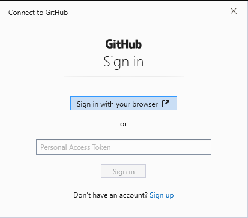

# Python and Git Setup

This demo is to guide students to setup and install Python and the Git Source Control.

## Python

### For Windows 10

1. Download and Install Anaconda

   - Go [Here](https://docs.anaconda.com/anaconda/install/windows/) and follow the steps

   _IMPORTANT NOTE_

   - Select the right version

   - Be sure to SELECT "Add Anaconda to the PATH environment variable"

   - don't need to install PyCharm

   - Install Anaconda to a directory path that does not contain spaces or unicode characters.

   - Verify: Open Anaconda Navigator

   - Close Anaconda navigator

2. Open Comman prompt and type:

```bash
python
```

3. To install additional dependencies, simple do

```
conda install [name of package]
```

4. For user guide and list of pre installed packages, visit [here](https://docs.anaconda.com/_downloads/9ee215ff15fde24bf01791d719084950/Anaconda-Starter-Guide.pdf).

## For Mac

1. Python is usually pre-installed on mac. To check (note tha capitalised V):

   ```bash
   python -V
   ```

   if you get something like this:

   ```
   Python 3.7.7
   ```

   then congratulations! You already have python installed

2. Otherwise,

3. Verify you have Pip, which is a dependency manager.

   ```bash
   pip -V
   ```

   You should get something like this:

   ```bash
   pip 20.1.1 from /opt/anaconda3/lib/python3.7/site-packages/pip (python 3.7)
   ```

## Git

1. Create and account in Github

2. Download and Install Git from [here](https://git-scm.com/downloads).

   - Just click next for all.

3. Connect Git to your Github

   ```
   git config --global user.email "[your email]"
   ```

4. Create a repository at github

5. Initialise git in the local repository

   ```bash
   git init
   ```

6. Stage file changes

   ```bash
   git add .
   ```

7. Commit your changes

   ```bash
   git commit -m "this is my first commit"
   ```

8. Configure git remote location

   ```bash
   git remote add [link to your repository]
   ```

9. Git push to your repository in github

   ```bash
   git push origin master
   ```

10. If it is your first time doing this, you will get a pop up that allows you to verify your github credentials, which looks like this:

    

11. Simply type in your email and password, and your local changes will reflect on your Github repository.

## Once you have made changes to your file

1.  You may check to see which files have been added, removed, or modified. Simple run:

    ```bash
    git status
    ```

    You may get something like this:

    ```bash
    On branch master

    Changes not staged for commit:
    (use "git add <file>..." to update what will be committed)
    (use "git restore <file>..." to discard changes in working directory)
    modified: README.md

    no changes added to commit (use "git add" and/or "git commit -a")
    ```

2.  Add the files you want to track, and commit, giving a meaningful message.

    ```bash
    git add . or git add README.md

    git commit -m "README file update"
    ```

3.  Push the changes to your remote master repository.

    ```bash
    git push origin master
    ```

4.  (OPTIONAL) If you run `git push` without specifying the source and destination, you will get an error like this:

    ```bash
    fatal: The current branch master has no upstream branch.
    To push the current branch and set the remote as upstream, use

        git push --set-upstream origin master
    ```

    If you are planning to only work on the master branch (NOT RECOMMENDED), and would like to configure git to remember that you are always going to push from origin to master, you can set the remote as upstream:

    ```bash
    git push --set-upstream origin master
    ```

    Otherwise, dont set this configuration. Instead, always specify which branch you want to push to:

    ```bash
    git push origin [name of branch to push to]
    ```
